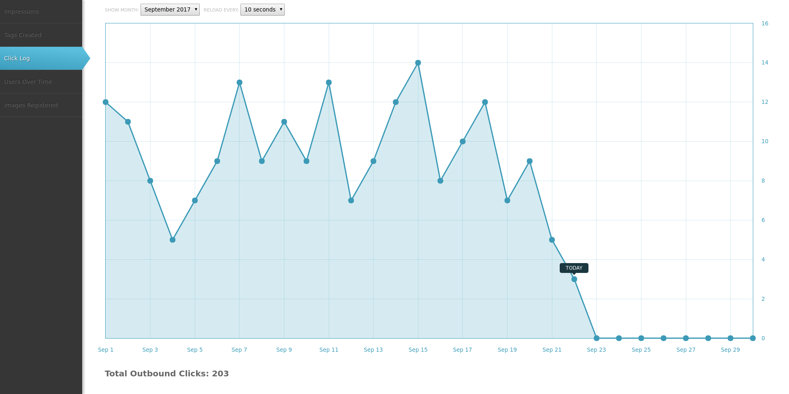

# Pinup Reports

This is a simple user interface for admins to view stats on their images and tag conversions.
### Requirements

The following programs must be install on your machine before you may install.

- [Vagrant](https://www.vagrantup.com/downloads.html)
- [VirtualBox](https://www.virtualbox.org/wiki/Downloads)

### Install

```bash
vagrant plugin install vagrant-hostsupdater
vagrant up
```

The server will now be available on the [pinup-reports.dev](http://pinup-reports.dev/) domain.

### Screenshots

